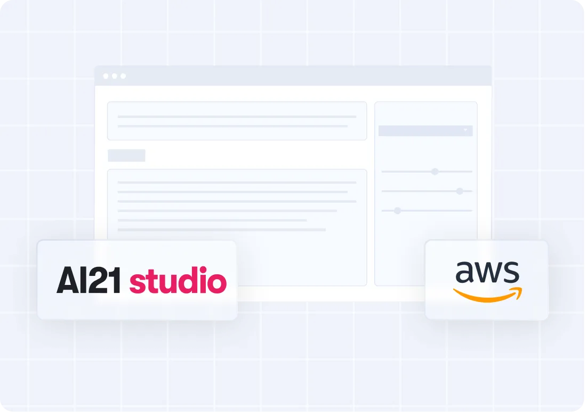

## AI21 on AWS examples
Welcome to the repository hosting example use of AI21 models on AWS! You will find a few folders within this repository that give various examples.

### AI21 Sagemaker Cookbooks
Within this folder, find examples on prompting for Jamba Instruct model with the Bedrock API

### AI21 Bedrock Cookbooks
 This folder represents these cookbooks leveraging Bedrock APIs (Converse and Invoke_Model) to help customers become familiar with Bedrock APIs.

### RAG Recipes
This folder contains example notebooks leveraging RAG approach with models from AI21 including Jamba Instruct and TSM models.

AI21 has consolidated and created a "cookbook" providing examples of using their models. AI21's Cookbooks can be found here https://github.com/AI21Labs/AI21-Industry-Samples!

## Security

See [CONTRIBUTING](CONTRIBUTING.md#security-issue-notifications) for more information.

## License

This library is licensed under the MIT-0 License. See the LICENSE file.
